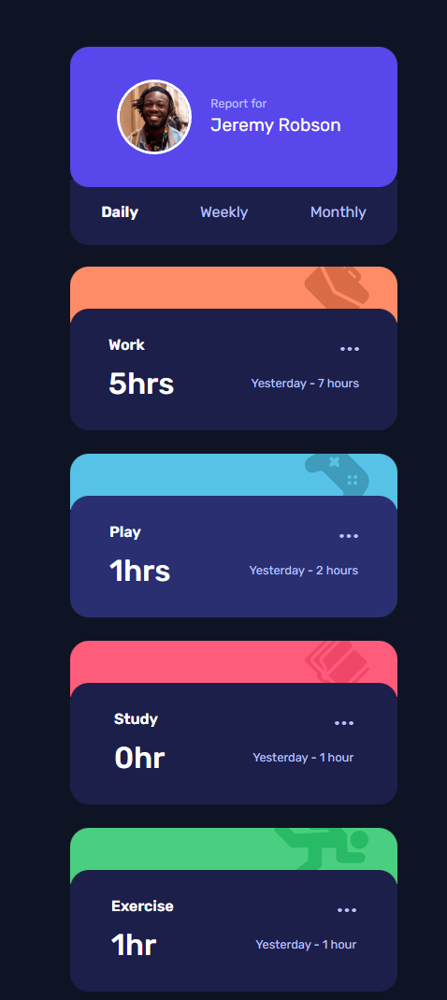
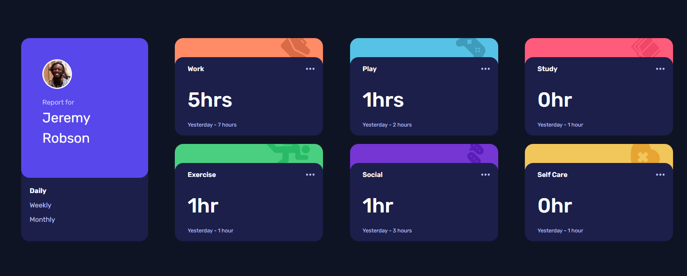

# Frontend Mentor - Time tracking dashboard solution

This is a solution to the [Time tracking dashboard challenge on Frontend Mentor](https://www.frontendmentor.io/challenges/time-tracking-dashboard-UIQ7167Jw). Frontend Mentor challenges help you improve your coding skills by building realistic projects.

I had quite some fun building this out using Astro. As I dive a bit further into component based frameworks, building this out was challenging but rewarding!

## Table of contents

- [Frontend Mentor - Time tracking dashboard solution](#frontend-mentor---time-tracking-dashboard-solution)
  - [Table of contents](#table-of-contents)
  - [Overview](#overview)
    - [The challenge](#the-challenge)
    - [Screenshot](#screenshot)
    - [Mobile](#mobile)
    - [Desktop](#desktop)
    - [Links](#links)
  - [My process](#my-process)
    - [Built with](#built-with)
    - [What I learned](#what-i-learned)
    - [Continued development](#continued-development)
    - [Useful resources](#useful-resources)
  - [Author](#author)

## Overview

### The challenge

Users should be able to:

- View the optimal layout for the site depending on their device's screen size ✅
- See hover states for all interactive elements on the page ✅
- Switch between viewing Daily, Weekly, and Monthly stats ✅

### Screenshot

### Mobile



### Desktop



### Links

- Live Site URL: [Solution](https://time-tracking-mentor.vercel.app/)

## My process

### Built with

- Semantic HTML5 markup
- Flexbox
- CSS Grid
- Mobile-first workflow
- [Astro](https://astro.build/) - JS Framework

### What I learned

Using components to render the profiles, as well as frontmatter code to render which time-frame was selected was fun to figure out! Passing props to the components that are then rendered by the layout component was a good learning experience in terms of getting familar with how Astro works.

```html
<Profile MonthlySelected />
<Profile DailySelected />
<Profile WeeklySelected />
```

```html
<Card
  color="light_red_work"
  icon="./src/assets/icon-work.svg"
  heading="Work"
  hours="32hrs"
  lastweek="Last week - 36 hours"
/>
```

Replicating the stacking effect of the card was challenging at first - but the z-index came to the rescue.

```css
.profile_card {
  z-index: 1;
}
```

Hiding the overflow on the icon images on the 'bottom' stacked card allowed me to replicate an effect of the images essentially being cut off by the edges of its container.

```css
.icon_wrapper {
  overflow: hidden;
}
```

### Continued development

I really enjoyed building this project out with Astro - I'll certainly be experimenting further with Astro as well as other JavaScript libraries such as React.

### Useful resources

- [Astro Docs](https://docs.astro.build/en/getting-started/) - I referenced this often while building this out. Highly reccomend - it's really well written and structured.

## Author

- Github - [Zayaan](https://github.com/zayaanw)
- Frontend Mentor - [@zayaanw](https://www.frontendmentor.io/profile/zayaanw)
